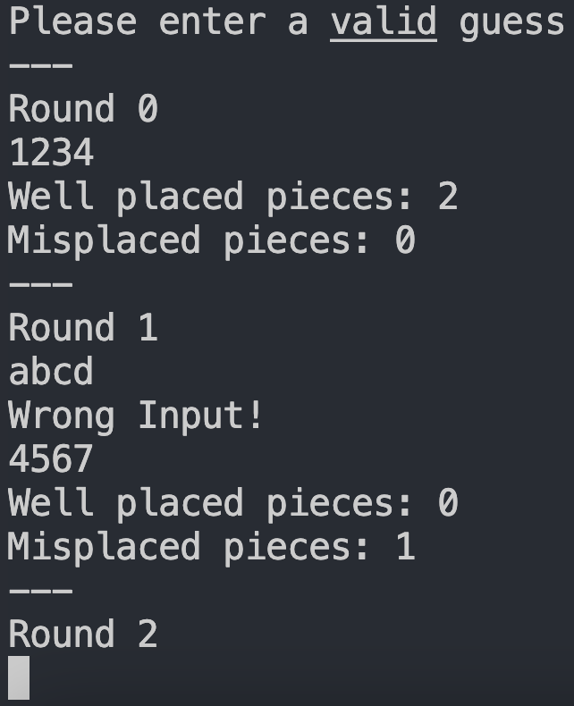

# <h1 align="center" >my_mastermind.c</h1>


A text-based game written in C that takes user input and evaluates it against a declared/randomly generated secret code. 

Based of the classic code-breaking game Mastermind, the goal is to guess the four integer secret code within 10 or a designated number of rounds. If a valid guess isn't correct then feedback will be provided - 'well-placed' integers are ones that are correct in value and position, 'misplaced' integers are ones that are correct in value but inocrrect in position.

The game runs in the terminal, recieving input through STDIN (the keyboard). Ctrl + d (^d) has been implemented to end the program at the players' discretion. 



## Table of Contents
- [Installation](#installation)
- [Usage](#usage)
    -[Usage: Customise](#customising-your-game)

## Installation

This program comes with a Makefile which will handle all the necessary compilation processes for installation.

1. Clone the repository:
```bash
git clone <repository URL>
```

2. Compile program in directory:
```bash
make
```

## Usage

To run the project, use the following commands (assuming repository has been pulled to local directory):

```bash
make
```
(Note: This will compile and the run program with the default number of 10 Rounds and a randomly generated Secret Code)

### Customising Your Game:

1. To declare a Secret Code:

```bash
./my_mastermind.c -c <"Your 4 digit code here">
```
(Note: Replace <"Your 4 digit code here"> with a valid four digit number, e.g. ./my_mastermind -c 1234)


2. To declare the number of Rounds:

```bash
./my_mastermind.c -t <"No. of Rounds">
```

(Note: Replace <"No. of Rounds"> with a valid number, e.g. ./my_mastermind -t 20)


3. To Declare both a Secret Code and a Number of Rounds:

```bash
./my_mastermind.c -c <"4 digit code"> -t <"No. of Rounds">
```